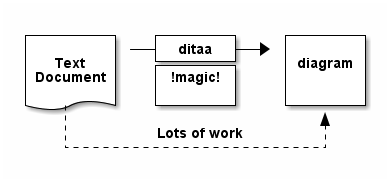

cucumber-contrib
================

Compatible with cucumber-jvm `1.1.5`


Maven dependencies
------------------

```xml
    <properties>
        <cucumber-contrib.version>0.0.3</cucumber-contrib.version>
    </properties>

    <dependency>
        <groupId>org.technbolts</groupId>
        <artifactId>cucumber-contrib</artifactId>
        <version>${cucumber-contrib.version}</version>
    </dependency>
```

Example
-------

```java
package sample.coffeemachine;

import cucumber.api.junit.Cucumber;
import cucumber.contrib.formatter.pdf.PdfFormatter;
import cucumber.contrib.junit.CommentDocBlockFilter;
import cucumber.contrib.junit.CucumberExt;
import cucumber.contrib.junit.CucumberExtOptions;
import org.junit.runner.RunWith;

import java.io.File;
import java.io.FileNotFoundException;

// CucumberExt allows several pre-processing of the feature before feeding Cucumber
// such as 'CommentDocBlockFilter'
@RunWith(CucumberExt.class)
@CucumberExtOptions(filters = CommentDocBlockFilter.class)
@Cucumber.Options(
        // indicate the pdf Formatter
        // configuration is done through the Formatter itself see below
        format = {"sample.coffeemachine.RunCucumberTest$ConfiguredFormatter:target/pdf"}
)
public class RunCucumberTest {

    public static class ConfiguredFormatter extends PdfFormatter {
        public ConfiguredFormatter(File reportDir) throws FileNotFoundException {
            super(reportDir, defaultConfiguration()
                            .withMetaInformationsResources(RunCucumberTest.class, "00-meta.properties")
                                    // override some of the previous meta infomations
                            .withReportFilename("coffee-machine-specs.pdf")
                            .withAuthor("Arnauld")
                            .withTitle("Coffee Machine Specification")
                            .withPreambuleResource(RunCucumberTest.class, "00-preambule.md")
                            .withDocumentMargin(10, 40)
                            .withDescriptionMargin(0, 0, 5, 5)
                            .withScenarioMargin(0, 0, 2, 5)
                            .displayUri(false)
                            .displayTags(false)
            );
        }
    }
}
```


Predefined Filter
-----------------

Because the markdown syntax can be incompatible with the gherkin language the first approach is to rely on comment
to ensure markdown part can still be parsed, e.g.:

```gherkin
# **In order** to send commands to the drink maker
#
#  **As a** developer
#
#  **I want to** implement the logic that translates orders
#  from customers of the coffee machine to the drink maker
```

This is roughly equivalent to the following with the `CommentDocBlockFilter` filter

```
--
**In order** to send commands to the drink maker

**As a** developer

**I want to** implement the logic that translates orders
from customers of the coffee machine to the drink maker
--
```

the docblock is delimited by the `--` lines, by activating the filter through
`@CucumberExtOptions(filters = CommentDocBlockFilter.class)` the docblock is
converted into the previous commented equivalent.


3rd party connector: ditaa
--------------------------

[Ditaa](http://ditaa.sourceforge.net/#usage)

A ditaa block can added to your documentation through the following syntax

```
[ditaa]
----

  +--------+   +-------+    +-------+
  |        | --+ ditaa +--> |       |
  |  Text  |   +-------+    |diagram|
  |Document|   |!magic!|    |       |
  |     {d}|   |       |    |       |
  +---+----+   +-------+    +-------+
      :                         ^
      |       Lots of work      |
      +-------------------------+

----
```

which will be rendered to:




3rd party libraries
-------------------

```xml
    <properties>
        <asciitech.version>0.0.5</asciitech.version>
    </properties>


    <dependency>
        <groupId>org.technbolts</groupId>
        <artifactId>asciitech</artifactId>
        <classifier>third-parties</classifier>
        <version>${asciitech.version}</version>
    </dependency>
```

* [Ditaa](http://ditaa.sourceforge.net/#usage)
* [LaTex short math Guide](ftp://ftp.ams.org/ams/doc/amsmath/short-math-guide.pdf)

